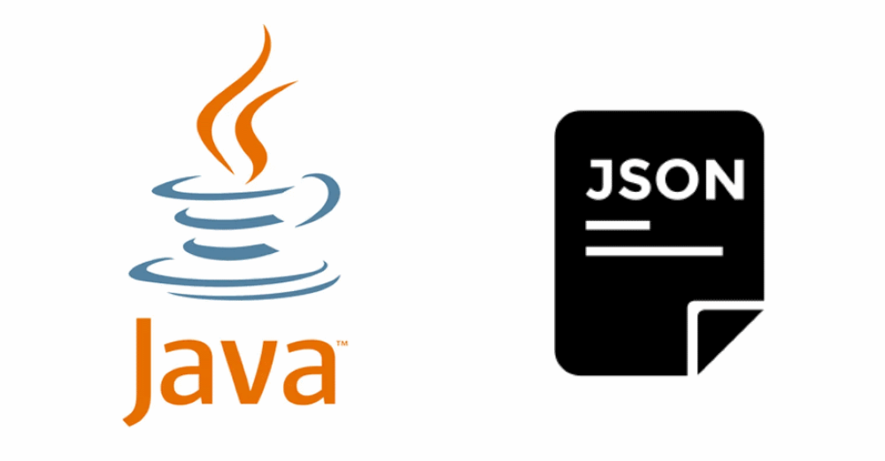
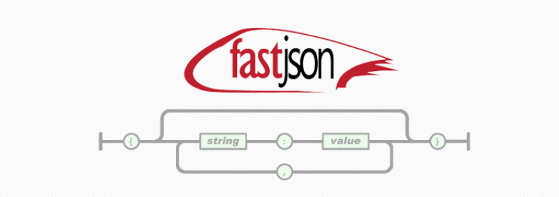

# Java操作JSON框架入门学习

## Json-Java

- JSON-java
- JSONUtil
- jsonp
- Json-lib
- Stringtree
- SOJO
- json-taglib
- Flexjson
- Argo
- jsonij
- fastjson
- mjson
- jjson
- json-simple
- json-io
- google-gson
- FOSS Nova JSON
- Corn CONVERTER
- Apache johnzon
- Genson
- cookjson
- progbase

## Fastjson

[练习项目](projects/fastjson_test)
